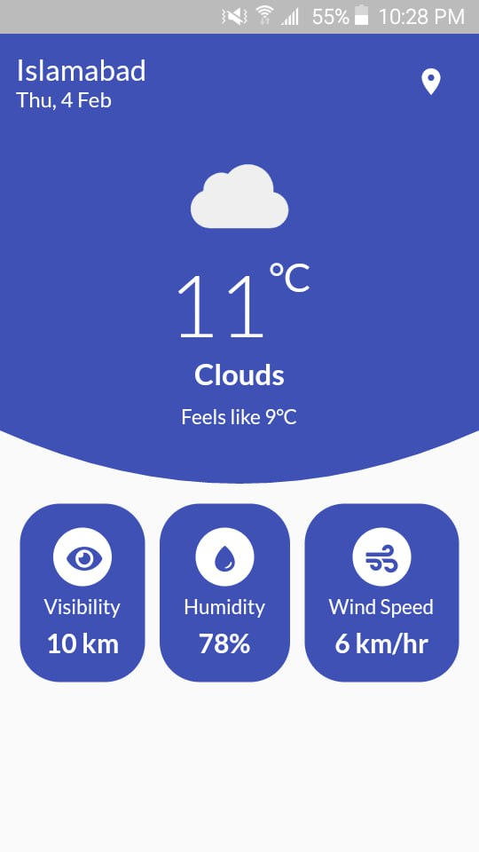

# WeatherCast 🌤️⛅🌦️

A minimalist, accurate weather application built with Flutter using MVVM architecture and OpenWeatherMap API.

## Key Features ✨
- Real-time weather data from OpenWeatherMap API
- Clean, intuitive UI with responsive design
- Essential weather metrics (temp, humidity, wind, visibility)
- Location-based forecasts
- Smooth animations and transitions
- Refresh functionality
- Light/Dark mode support

## Technology Stack ⚙️
- **Framework**: Flutter 3.13.0
- **Architecture**: MVVM Pattern
    - **Model**: WeatherData from API
    - **View**: UI Widgets
    - **ViewModel**: Business logic layer
- **State Management**: SetState + Provider
- **API**: OpenWeatherMap
- **Dependencies**:
    - http: API calls
    - lottie: Animations
    - flutter_svg: Weather icons
    - intl: Date formatting
    - google_fonts: Typography

## Competitive Advantage 🏆
| Feature          | Our App | Yahoo | AccuWeather | Weather Channel |
|------------------|---------|-------|-------------|-----------------|
| Clean Interface  | ✅       | ✅     | ❌           | ❌               |
| No Ads          | ✅       | ❌     | ❌           | ❌               |
| Fast Performance| ✅       | ✅     | ❌           | ❌               |
| Accurate Data   | ✅       | ✅     | ✅           | ✅               |
| Light/Dark Mode | ✅       | ❌     | ❌           | ❌               |

## Installation 🛠️
1. flutter pub get
2. flutter run